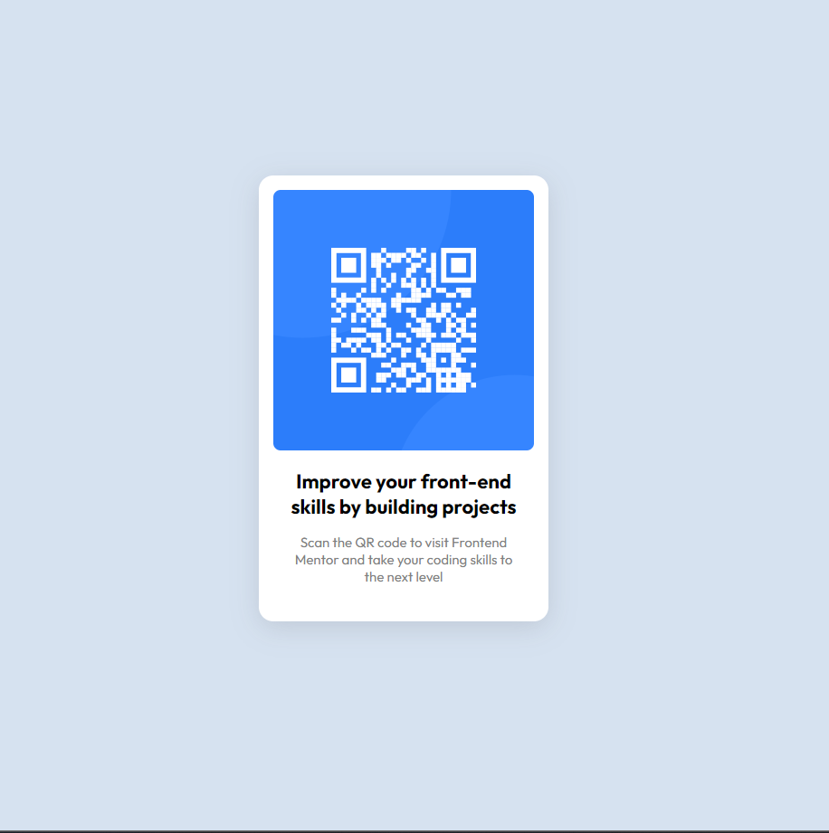

# Frontend Mentor - QR code component solution

This is a solution to the [QR code component challenge on Frontend Mentor](https://www.frontendmentor.io/challenges/qr-code-component-iux_sIO_H). Frontend Mentor challenges help you improve your coding skills by building realistic projects.

## Table of contents

- [Overview](#overview)
  - [Screenshot](#screenshot)
  - [Links](#links)
- [My process](#my-process)
  - [Built with](#built-with)
  - [What I learned](#what-i-learned)
  - [Useful resources](#useful-resources)
- [Author](#author)

## Overview

### Screenshot



### Links

- Solution URL: [Github](https://github.com/rabin7acharya/qr-component-frontend-mentor-challenge)
- Live Site URL: [Preview](https://rabin7acharya.github.io/qr-component-frontend-mentor-challenge/)

## My process

### Built with

- Semantic HTML5 markup
- CSS custom properties
- Flexbox

### What I learned

Working with HTML 5 & CSS is always fun. This tiny challenge refreshed my fundamental knowledge on HTML & CSS. Here are some of the facts about this project.

```html
<article class="qr-card">
  <div class="qr-image-wrapper">
    
  </div>
  <div class="qr-info">
    <h2 class="qr-info-title">
      Improve your front-end skills by building projects
    </h2>
    <p class="qr-info-description">
      Scan the QR code to visit Frontend Mentor and take your coding skills to
      the next level
    </p>
  </div>
</article>
```

The code above creates the structure of the QR code component. It uses the `<article>` tag to group the component's content and the `<div>` tag to create two sections: one for the QR code image and another for the information about the code. The `` tag displays the QR code image, and the `<h2>` and `<p>` tags display the title and description, respectively. The classes applied to each element can be used to style the component using CSS.

```css
.qr-card {
  width: 20rem;
  padding: 1rem;
  background-color: hsl(0, 0%, 100%);
  border-radius: 1rem;
  display: flex;
  flex-direction: column;
  box-shadow: rgba(100, 100, 111, 0.2) 0px 7px 29px 0px;
}
```

The .qr-card selector sets the following properties:

- width: 20rem; - sets the width of the container to 20rem (a unit of measurement based on the font size of the root element).
- padding: 1rem; - adds 1rem of padding to all sides of the container element.
  background-color: hsl(0, 0%, 100%); - sets the background color of the container element to white.
- border-radius: 1rem; - adds a border radius of 1rem to all corners of the container element, giving it a rounded appearance.
- display: flex; - sets the display property of the container element to flex, allowing its child elements to be aligned in a row or column.
- flex-direction: column; - sets the direction of the flex layout to be a column, aligning the child elements vertically.
- box-shadow: rgba(100, 100, 111, 0.2) 0px 7px 29px 0px; - adds a box shadow to the container element, with a color value of rgba(100, 100, 111, 0.2), an x-offset of 0px, a y-offset of 7px, a blur radius of 29px, and no spread radius. This gives the container element a subtle drop shadow effect, making it appear to float above the background.

### Useful resources

- [Css Box Shadow](https://getcssscan.com/css-box-shadow-examples) - Get beautiful css box shadow examples for free.

## Author

- Website - [Rabin Acharya](https://www.rabinacharya7.com.np)
- Frontend Mentor - [@rabin7acharya](https://www.frontendmentor.io/profile/rabin7acharya)
